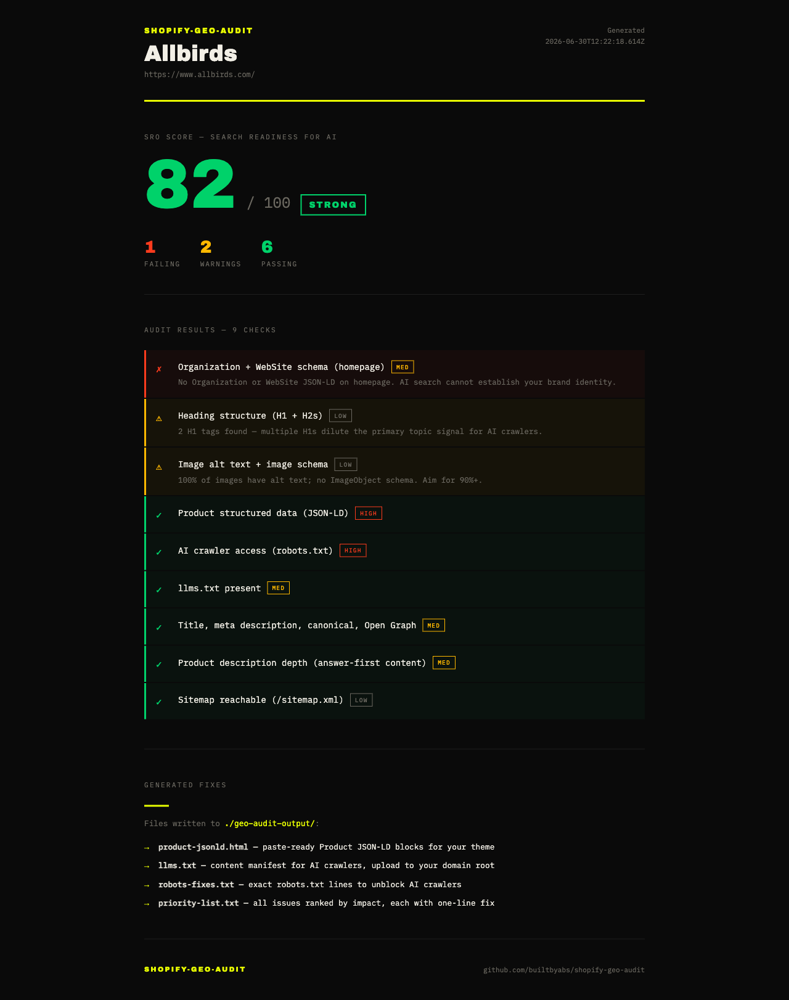

# shopify-geo-audit

[](https://www.npmjs.com/package/shopify-geo-audit)
[](https://github.com/builtbyabs/shopify-geo-audit/actions/workflows/ci.yml)
[](LICENSE)

Audit any Shopify store for AI-search readiness, then generate the fixes you actually paste in.

```bash
npx shopify-geo-audit https://your-store.com
```


No account, no API key, no config. It fetches the storefront, runs a set of checks for the signals that ChatGPT, Perplexity, Gemini and Google's AI Overviews read, scores the store 0-100, and writes paste-ready fixes to `./geo-audit-output/`.

Want it on your PATH instead of `npx`? `npm i -g shopify-geo-audit`.

## Why I built this

I do a lot of Shopify work, and "are we showing up in AI answers?" became a real client question fast. The existing tools mostly hand you a dashboard that says you're invisible and stop there. The useful part, the part that takes an afternoon by hand, is producing the actual structured data and config. So I wrote the thing that does that part.

It's deliberately small and offline. One command, runs locally, nothing leaves your machine except the requests to the store you're auditing.

## What it checks

Nine checks, weighted by how much they matter for getting cited:

| Check | Weight |
| --- | --- |
| Product JSON-LD (`Product`/`Offer`) on product pages | high |
| robots.txt isn't blocking GPTBot / ClaudeBot / PerplexityBot / Google-Extended | high |
| `Organization` + `WebSite` schema on the homepage | medium |
| `/llms.txt` exists | medium |
| Title, meta description, canonical, Open Graph | medium |
| Product description depth + answer-first lead | medium |
| One H1, sensible H2s | low |
| Image alt text + image schema | low |
| `sitemap.xml` reachable | low |

The result is an **SRO Score** (Search Readiness for AI): 80-100 strong, 50-79 needs work, below 50 at risk.

## What it generates

The output isn't a report you read and forget. It's files:

- `product-jsonld.html` — a valid `Product` block filled from your store's real data, ready for your theme
- `llms.txt` — a content manifest for your domain
- `robots-fixes.txt` — the exact lines to stop blocking AI crawlers
- `priority-list.txt` — every failing check, ranked, each with a one-line fix

Pass `--html` and you also get a self-contained `report.html` you can screenshot or send a client:



## Example

```
$ npx shopify-geo-audit https://acme-coffee.com

  ────────────────────────────────────────────────────────────

  Acme Coffee
  https://acme-coffee.com/

  SRO Score: 41/100  ■ AT RISK

  ────────────────────────────────────────────────────────────

  ✗    HIGH   Product structured data (JSON-LD)
              No valid Product JSON-LD found on 4 product pages. AI can't parse your products.
  ✗    MED    llms.txt present
              /llms.txt not found — no content manifest for AI crawlers.
  ✗    MED    Product description depth (answer-first content)
              Avg 38 words per product page — too thin.
  ✗    HIGH   AI crawler access (robots.txt)
              robots.txt blocks: GPTBot, ClaudeBot.
  ✓    MED    Title, meta description, canonical, Open Graph
  ✓    LOW    Sitemap reachable (/sitemap.xml)

  ────────────────────────────────────────────────────────────

  Generated fixes → ./geo-audit-output/
  product-jsonld.html  ·  llms.txt  ·  robots-fixes.txt  ·  priority-list.txt
```

## Usage

```bash
shopify-geo-audit <url> [options]

  -n, --products <n>   how many product pages to audit   (default: 5)
  -o, --out <dir>      where to write the fixes          (default: ./geo-audit-output)
  --html               also write a self-contained report.html
  --json               print raw results as JSON (for CI); fixes still get written
```

`--json` keeps stdout clean so you can pipe it:

```bash
shopify-geo-audit https://store.com --json | jq '.score.value'
```

## How it works

It's a straight pipeline with the side effects pushed to the edges:

```
fetch → parse → checks[] → score → fixers[] → report
```

Checks are pure functions `(store) => result`, one per file, so each is trivially testable and adding a new one is a single module. Fetching is SSRF-guarded (no requests to private or reserved addresses, redirects re-validated each hop) and everything parsed off the network is validated with [zod](https://zod.dev) before it's trusted.

## Development

```bash
git clone https://github.com/builtbyabs/shopify-geo-audit.git
cd shopify-geo-audit
npm install
npm run build
node bin/cli.js https://some-store.com

npm test          # vitest, one spec per check
npm run typecheck # strict, no any
```

## Contributing

Adding a check is the easiest contribution: drop a file in `src/checks/`, add a fixture and a test, wire it into `src/index.ts`. See [CONTRIBUTING.md](CONTRIBUTING.md). Issues and PRs welcome; `good first issue` is tagged.

## License

[MIT](LICENSE) © Abhishek Chauhan
